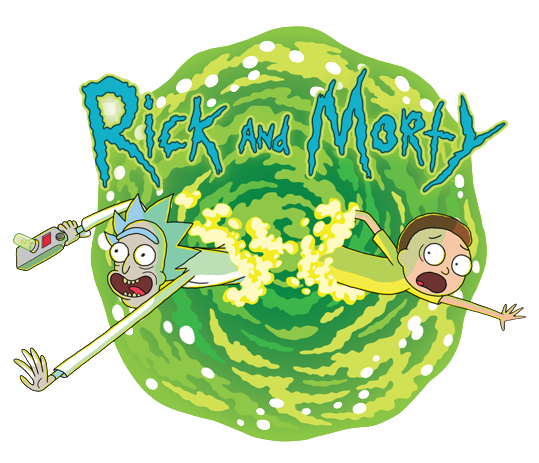

# rick-morty-api

<div align="center">
  
  <h1>Rick and Morty API</h1>
</div>

<!-- Table of Contents -->
# :notebook_with_decorative_cover: Table of Contents

- [About the Project](#star2-about-the-project)
  * [Screenshots](#camera-screenshots)
  * [Tech Stack](#space_invader-tech-stack)
  * [Features](#dart-features)
- [Getting Started](#toolbox-getting-started)
  * [Prerequisites](#bangbang-prerequisites)
  * [Installation](#gear-installation)
  * [Installation and Run Locally](#running-installation-and-run-locally)
  * [Deployment](#triangular_flag_on_post-deployment)
- [Contributing](#wave-contributing)
- [License](#warning-license)
- [Contact](#handshake-contact)
- [Acknowledgements](#gem-acknowledgements)


<!-- About the Project -->
## :star2: About the Project

This is project is a client side web page, created using:

<li><a href="https://es.vuejs.org/">Vue JS</a></li>
<li><a href="https://router.vuejs.org/">Vue Router</a></li>
<li><a href="https://vuestic.dev/">Vuestic UI</a></li>
<li><a href="https://rickandmortyapi.com/">The Rick and Morty API</a></li>

<!-- Screenshots -->
### :camera: Screenshots

<div align="center"> 
  
</div>

<div align="center"> 
  
</div>

<!-- TechStack -->
## :space_invader: Tech Stack

<li><a href="https://es.vuejs.org/">Vue JS</a></li>
<li><a href="https://router.vuejs.org/">Vue Router</a></li>
<li><a href="https://vuestic.dev/">Vuestic UI</a></li>
<li><a href="https://rickandmortyapi.com/">The Rick and Morty API</a></li>

<!-- Features -->
### :dart: Features

- Vue Router
- Skeleton loader
- Api Calls

<!-- Getting Started -->
## 	:toolbox: Getting Started

<!-- Prerequisites -->
### :bangbang: Prerequisites

- To run this project you need:
  * NodeJS
  * Vue JS (Min. Ver. 3.0)

Once you have that, you're ready to go

<!-- Installation and Run Locally -->
### :running: Installation and Run Locally

Clone the project

```bash
  git clone https://github.com/jesusalberto11/Rick-Morty-Api
```

Go to the project directory

```bash
  cd Rick-Morty-Api
```

Install dependencies

```bash
  npm install
```

Start the development server

```bash
  npm run serve
```

<!-- Deployment -->
### :triangular_flag_on_post: Deployment

To deploy this project run

```bash
  npm run build
```

<!-- Contributing -->
## :wave: Contributing

<a href="https://github.com/Louis3797/awesome-readme-template/graphs/contributors">
  
</a>


Contributions are always welcome!

Please send a message if you're interested in contributing to the proyect.

<!-- License -->
## :warning: License

Distributed under the MIT License. See LICENSE for more information.


<!-- Contact -->
## :handshake: Contact

Jesus Alberto - [@LinkedIn](https://www.linkedin.com/in/jesus-alberto-morales-rico-7092a9227/)

<!-- Acknowledgments -->
## :gem: Acknowledgements

this project helped me understand the basics of Vue JS, I learned how to create and reuse components, make calls to public APIs and manage information between components and finally, the use of the Vue Router.